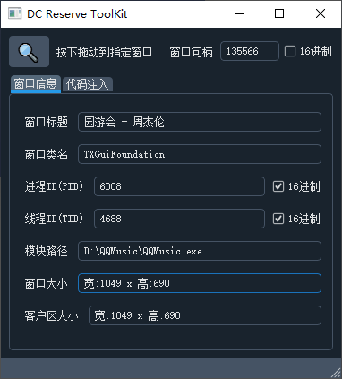
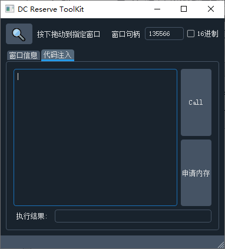

# ReverseToolKit
## 项目介绍
本项目是一个方便游戏安全人员查看窗口信息, 调试CALL的工具箱
之前有各种各样的WinSpy工具和代码注入器
但始终不是很称手, 比如pid经常需要到计算器里转换进制
WinSpy类似的开源项目基本都是基于C/C++, 代码异常复杂
在前人造了这么多轮子的情况下, 这个东西做起来应该很简单
于是我用PySide2写了这样一个逆向工具
后面发现用python写的工具虽然开发方便, 但编绎后文件太大,
且启动速度较慢, 所以后面改用C++重写了一遍, 这个项目暂停更新
新项目请见: https://github.com/decenfrontier/WinHackTool

## 功能介绍
#### 1. 窗口信息

#### 2. 代码注入
